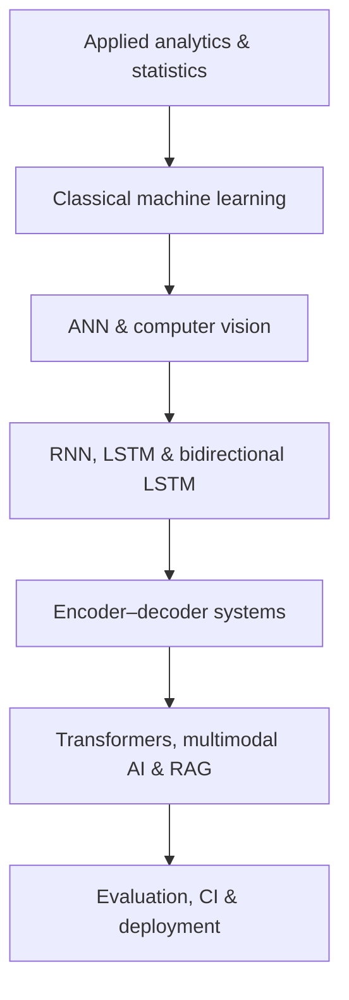

  

  
  
  

## I turn complex data into evaluated, usable ML systems

I am **Anmol Tripathi**, a Quality Data Scientist working across data science, machine learning, applied AI, analytics engineering, and business-facing automation. My work spans the full path from data preparation and experimentation to model evaluation, reproducible inference, CI validation, and interactive deployment.

This portfolio documents a deliberate technical progression: **applied analytics → classical machine learning → deep neural networks → sequence models → Transformers → deployed AI applications**.

> **Current focus:** reliable NLP, retrieval, multimodal AI, model benchmarking, and production-oriented ML workflows—built with transparent evaluation and responsible-use documentation.

## Selected work

<table>
  <tr>
    <td width="50%" valign="top">
      <h3><a href="https://github.com/unit-mole/transformer-projects">Transformer & Multimodal AI Portfolio</a></h3>
      
<strong>10 completed and deployed projects</strong> spanning summarization, translation, semantic retrieval, reranking, long-document QA, instruction tuning, visual question answering, Vision Transformers, CLIP, and RAG.

      
<code>PyTorch</code> <code>Transformers</code> <code>LoRA/PEFT</code> <code>ONNX</code> <code>GitHub Actions</code>

      
<a href="https://github.com/unit-mole/transformer-projects#completed-projects"><strong>Explore projects →</strong></a>

    </td>
    <td width="50%" valign="top">
      <h3><a href="https://github.com/unit-mole/encoder-decoder-projects">Encoder–Decoder Systems</a></h3>
      
End-to-end encoder–decoder applications including schema-aware Text-to-SQL, streaming-style speech recognition, and data-to-text executive reporting.

      
<code>CodeT5+</code> <code>Whisper</code> <code>FLAN-T5</code> <code>Transformers.js</code> <code>WebGPU</code>

      
<a href="https://github.com/unit-mole/encoder-decoder-projects"><strong>Explore repository →</strong></a>

    </td>
  </tr>
  <tr>
    <td width="50%" valign="top">
      <h3><a href="https://github.com/unit-mole/applied-data-science-machine-learning-portfolio">Applied Data Science & ML</a></h3>
      
A portfolio of analytical and predictive workflows demonstrating problem framing, preprocessing, EDA, statistical reasoning, feature engineering, model comparison, and business communication.

      
<code>Python</code> <code>SQL</code> <code>scikit-learn</code> <code>Pandas</code> <code>Power BI</code>

      
<a href="https://github.com/unit-mole/applied-data-science-machine-learning-portfolio"><strong>Explore repository →</strong></a>

    </td>
    <td width="50%" valign="top">
      <h3><a href="https://github.com/unit-mole/cnn-projects">Computer Vision with CNNs</a></h3>
      
Computer-vision projects organized around convolutional architectures, data pipelines, model training, evaluation, and visual error analysis.

      
<code>Computer Vision</code> <code>CNNs</code> <code>Transfer Learning</code> <code>Evaluation</code>

      
<a href="https://github.com/unit-mole/cnn-projects"><strong>Explore repository →</strong></a>

    </td>
  </tr>
</table>

## Engineering range

| Capability | Evidence in this portfolio |
|---|---|
| **Applied Data Science** | EDA, statistical analysis, feature engineering, predictive modeling, business-facing visualization |
| **Classical Machine Learning** | Classification, regression, clustering, ensemble modeling, benchmarking, calibration, error analysis |
| **Deep Learning** | ANN, CNN, RNN, LSTM, bidirectional LSTM, encoder–decoder, and Transformer architectures |
| **NLP & Retrieval** | Summarization, translation, QA, semantic search, dense retrieval, cross-encoder reranking, RAG |
| **Computer Vision & Multimodal AI** | CNNs, Vision Transformers, visual question answering, CLIP image–text retrieval |
| **ML Engineering** | Reproducible training, modular inference, GPU/BF16 workflows, ONNX conversion, testing, CI/CD, deployment |
| **Analytics Engineering** | Python/SQL automation, structured reporting, Power BI, and decision-oriented communication |

## From foundations to deployed AI

  <a href="https://github.com/unit-mole/ann-deep-learning-projects">ANN</a> ·
  <a href="https://github.com/unit-mole/simple-rnn-projects">RNN</a> ·
  <a href="https://github.com/unit-mole/lstm-projects">LSTM</a> ·
  <a href="https://github.com/unit-mole/bi-directional-lstm-projects">BiLSTM</a> ·
  <a href="https://github.com/unit-mole/cnn-projects">CNN</a> ·
  <a href="https://github.com/unit-mole/encoder-decoder-projects">Encoder–Decoder</a> ·
  <a href="https://github.com/unit-mole/transformer-projects">Transformers</a>

## Technical toolkit

**Languages & analysis**  

**Machine learning & deep learning**  

**Delivery & visualization**  

## Applied ML in industry

My professional work combines quality data, operational context, analytics, automation, and machine learning. I build workflows that help teams move from fragmented data to repeatable analysis and decision support—including data preparation, classification, model validation, dashboarding, and automated reporting.

Public repositories contain portfolio work and non-confidential demonstrations only. Proprietary data, internal systems, and company methodology are intentionally excluded.

## How I build

1. **Frame the decision** — define the real problem, target, constraints, and meaningful evaluation criteria.
2. **Establish evidence** — validate data, build baselines, compare candidates, and inspect failure modes.
3. **Engineer for reuse** — separate training and inference, preserve metadata, test artifacts, and document assumptions.
4. **Deliver responsibly** — expose limitations, validate deployments, and communicate results for technical and business audiences.

## Explore the portfolio

| Path | Best starting point |
|---|---|
| **AI / ML Engineering** | [Transformer projects](https://github.com/unit-mole/transformer-projects) → testing, CI, ONNX, browser inference, deployed applications |
| **NLP / Generative AI** | [Encoder–decoder projects](https://github.com/unit-mole/encoder-decoder-projects) → Text-to-SQL, speech recognition, data-to-text systems |
| **Data Science / Analytics** | [Applied DS & ML portfolio](https://github.com/unit-mole/applied-data-science-machine-learning-portfolio) → analysis, modeling, evaluation, business communication |
| **Computer Vision** | [CNN projects](https://github.com/unit-mole/cnn-projects) and [Vision Transformer work](https://github.com/unit-mole/transformer-projects/tree/main/08-image-classification-vision-transformer) |
| **Sequence Modeling** | [RNN](https://github.com/unit-mole/simple-rnn-projects) → [LSTM](https://github.com/unit-mole/lstm-projects) → [BiLSTM](https://github.com/unit-mole/bi-directional-lstm-projects) |

---

  <strong>Interested in data science, ML engineering, or applied AI?</strong> 
  <a href="https://www.linkedin.com/in/anmol-tripathi-60311917a/">Connect with me on LinkedIn</a>

<!-- FUTURE ADDITIONS (activate only when verified): personal website, downloadable resume, email, publications, technical writing, certifications, Kaggle, and featured production ML case studies. -->
