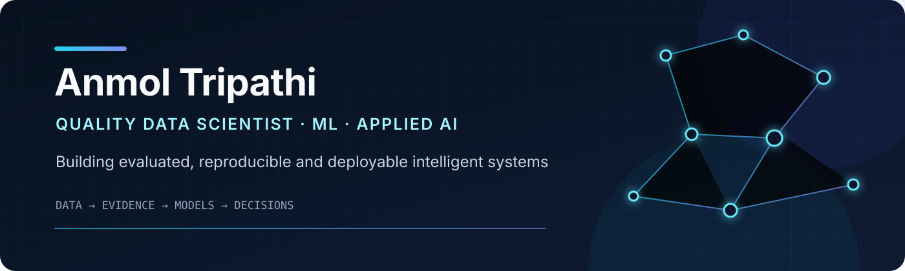

  

  
  
  

  
  

  
  

<!-- After the website is published, replace #portfolio-website in the Portfolio badge with the verified website URL and change Coming_Soon to Visit_Website. -->

## I turn complex data into grounded AI systems, defensible predictions, and decision-ready insights

I am **Anmol Tripathi**, a **Quality Data Scientist and Machine Learning Engineer** with **7+ years of experience** across network operations, analytics, predictive modeling, deep learning, NLP, retrieval-augmented generation, agentic AI, and applied AI.

At [Hach](https://www.hach.com/), I develop machine-learning and AI solutions for product-quality intelligence, including source-grounded RAG workflows, multi-stage NLP classification, analytics automation, and executive reporting. My public portfolio translates that experience into non-confidential, reproducible projects spanning statistical learning, neural networks, sequence models, Transformers, multimodal AI, retrieval, agentic workflows, and deployment.

> **Current focus:** evidence-grounded RAG and agentic AI, hybrid retrieval and reranking, graph-enhanced reasoning, bounded tool use, transparent evaluation, and production-oriented ML workflows.

## Selected work

<table>
  <tr>
    <td width="50%" valign="top">
      <h3><a href="https://github.com/unit-mole/transformer-projects">Transformer &amp; Multimodal AI Portfolio</a></h3>
      
<strong>10 end-to-end projects</strong> covering summarization, translation, retrieval, reranking, long-document QA, instruction tuning, VQA, Vision Transformers, CLIP, and RAG, with selected public demos.

      
<code>PyTorch</code> <code>Transformers</code> <code>LoRA/PEFT</code> <code>ONNX</code> <code>GitHub Actions</code>

      
<a href="https://github.com/unit-mole/transformer-projects#completed-projects"><strong>Explore projects →</strong></a>

    </td>
    <td width="50%" valign="top">
      <h3><a href="https://github.com/unit-mole/encoder-decoder-projects">Encoder-Decoder Systems</a></h3>
      
Applied generation systems including schema-aware Text-to-SQL, streaming-style speech recognition, and source-grounded data-to-text executive reporting.

      
<code>CodeT5+</code> <code>Whisper</code> <code>FLAN-T5</code> <code>Transformers.js</code> <code>WebGPU</code>

      
<a href="https://github.com/unit-mole/encoder-decoder-projects"><strong>Explore repository →</strong></a>

    </td>
  </tr>
  <tr>
    <td width="50%" valign="top">
      <h3><a href="https://github.com/unit-mole/applied-data-science-machine-learning-portfolio">Applied Data Science &amp; Machine Learning</a></h3>
      
<strong>13 projects</strong> demonstrating statistical reasoning, EDA, feature engineering, forecasting, segmentation, model comparison, explainability, and business communication.

      
<code>Python</code> <code>SQL</code> <code>scikit-learn</code> <code>Pandas</code> <code>Tableau</code>

      
<a href="https://github.com/unit-mole/applied-data-science-machine-learning-portfolio"><strong>Explore repository →</strong></a>

    </td>
    <td width="50%" valign="top">
      <h3><a href="https://github.com/unit-mole/cnn-projects">Computer Vision with CNNs</a></h3>
      
Computer-vision projects organized around convolutional architectures, transfer learning, reproducible data pipelines, model evaluation, and visual error analysis.

      
<code>Computer Vision</code> <code>CNNs</code> <code>Transfer Learning</code> <code>Evaluation</code>

      
<a href="https://github.com/unit-mole/cnn-projects"><strong>Explore repository →</strong></a>

    </td>
  </tr>
</table>

## RAG & Agentic AI systems

Four evidence-driven systems demonstrating retrieval, graph reasoning, bounded agents, verification, safety, observability, and domain-specific evaluation. The three standalone systems run as complete local engineering implementations; their public Hugging Face Spaces are transparent portfolio demonstrations built from validated outputs rather than unsupported claims of free GPU-backed inference.

<table>
  <tr>
    <td width="50%" valign="top">
      <h3><a href="https://github.com/unit-mole/reliabilityops-agentic-rag">ReliabilityOps</a></h3>
      
<strong>Evidence-grounded industrial root-cause investigation.</strong> Combines BGE-M3 + BM25/RRF retrieval, LangGraph orchestration, local Qwen3 reasoning, bounded analytical tools, independent verification, and Phoenix observability.

      
<strong>Frozen test:</strong> 93% RCA Top-1 · 100% Top-3 · 100% citation precision · 100% verification pass rate

      
<code>LangGraph</code> <code>Qwen3</code> <code>Qdrant</code> <code>PostgreSQL</code> <code>FastAPI</code> <code>Docker</code>

      
<a href="https://github.com/unit-mole/reliabilityops-agentic-rag"><strong>Repository →</strong></a> · <a href="https://huggingface.co/spaces/anmol-unitmole/reliabilityops-agentic-rag"><strong>Portfolio demo →</strong></a>

    </td>
    <td width="50%" valign="top">
      <h3><a href="https://github.com/unit-mole/repoatlas-agentic-rag">RepoAtlas</a></h3>
      
<strong>Graph-enhanced repository intelligence and safe coding agent.</strong> Maps issues to files and symbols, expands repository relationships, discovers affected tests, and verifies bounded candidate changes inside a network-disabled Docker sandbox.

      
<strong>Frozen test:</strong> 84.3% File Recall@20 · 75.7% File Recall@10 · 30.9 ms selected-retriever latency

      
<code>Hybrid Retrieval</code> <code>Repository Graph</code> <code>Qwen3</code> <code>FastAPI</code> <code>Docker Sandbox</code>

      
<a href="https://github.com/unit-mole/repoatlas-agentic-rag"><strong>Repository →</strong></a> · <a href="https://huggingface.co/spaces/anmol-unitmole/repoatlas-agentic-rag"><strong>Portfolio demo →</strong></a>

    </td>
  </tr>
  <tr>
    <td width="50%" valign="top">
      <h3><a href="https://github.com/unit-mole/filingsgraph-agentic-rag">FilingsGraph</a></h3>
      
<strong>Temporal financial due-diligence and risk intelligence.</strong> Integrates SEC EDGAR filings, XBRL facts, hybrid retrieval, deterministic financial tools, temporal comparison, and a provenance-preserving company-risk graph.

      
<strong>Evaluation:</strong> 100% textual Recall@10 · 100% XBRL fact selection · 90% blind graph-edge precision · 100% citation precision

      
<code>SEC/XBRL</code> <code>BGE-M3</code> <code>Qwen3</code> <code>DuckDB</code> <code>NetworkX</code> <code>FastAPI</code>

      
<a href="https://github.com/unit-mole/filingsgraph-agentic-rag"><strong>Repository →</strong></a> · <a href="https://huggingface.co/spaces/anmol-unitmole/filingsgraph-agentic-rag"><strong>Portfolio demo →</strong></a>

    </td>
    <td width="50%" valign="top">
      <h3><a href="https://github.com/unit-mole/transformer-projects/tree/main/10-ai-portfolio-rag-assistant">AI Portfolio RAG Assistant</a></h3>
      
<strong>Public portfolio discovery through grounded retrieval.</strong> Searches 220 public AI/ML documents and 3,157 evidence chunks using MiniLM embeddings and hybrid retrieval, then returns source-cited answers with relevance and latency details.

      
<strong>Delivery:</strong> reproducible Python evaluation · Next.js APIs · GitHub Actions · production Vercel deployment

      
<code>MiniLM</code> <code>FLAN-T5</code> <code>DeBERTa NLI</code> <code>Next.js</code> <code>TypeScript</code> <code>Vercel</code>

      
<a href="https://github.com/unit-mole/transformer-projects/tree/main/10-ai-portfolio-rag-assistant"><strong>Source code →</strong></a> · <a href="https://10-ai-portfolio-rag-assistant.vercel.app/#assistant"><strong>Live application →</strong></a>

    </td>
  </tr>
</table>

**Across these systems:** hybrid retrieval · reranking · GraphRAG · agent orchestration · deterministic tools · citation verification · frozen-test evaluation · latency analysis · FastAPI · Docker · CI/CD · responsible-use controls

## Portfolio website

My dedicated portfolio website is the next stage of this professional portfolio and is currently being prepared. Once published, the **Portfolio** button above will link directly to the live website, bringing together my experience, flagship projects, deployed applications, technical case studies, and résumé in one place.

## Additional flagship systems

| Project | What it demonstrates | Explore |
|---|---|---|
| **Schema-Aware Text-to-SQL** | Fine-tunes CodeT5+ 770M with LoRA to generate SQLite from natural-language questions and database schemas, then validates and safely executes approved read-only queries. | [Source code](https://github.com/unit-mole/encoder-decoder-projects/tree/main/01-schema-aware-text-to-sql-encoder-decoder) · [Live application](https://schema-aware-text-to-sql.vercel.app/) |
| **Vision Transformer Browser Classifier** | Compares DeiT-tiny with ResNet-18, validates PyTorch-to-ONNX parity, visualizes attention rollout, and performs private WebGPU/WASM inference in the browser. | [Source code](https://github.com/unit-mole/transformer-projects/tree/main/08-image-classification-vision-transformer) · [Live application](https://unit-mole.github.io/transformer-projects/08-image-classification-vision-transformer/) |
| **Streaming Speech Recognition with Whisper** | Transcribes microphone or uploaded audio through a Whisper encoder-decoder workflow with chunking, timestamps, language detection, and robustness-oriented evaluation. | [Source code](https://github.com/unit-mole/encoder-decoder-projects/tree/main/03-streaming-speech-recognition-whisper-encoder-decoder) · [Live application](https://huggingface.co/spaces/anmol-unitmole/streaming-speech-recognition-whisper-encoder-decoder) |
| **Data-to-Text Executive Report Generator** | Converts structured KPI tables into source-grounded executive narratives while checking numerical claims, exposing source-cell evidence, and blocking unsupported statements. | [Source code](https://github.com/unit-mole/encoder-decoder-projects/tree/main/04-data-to-text-executive-report-generator) · [Live application](https://data-to-text-executive-report-gener.vercel.app/) |

## Explore live applications

<table>
  <tr>
    <td width="50%" valign="top" align="center">
      <h3>Schema-Aware Text-to-SQL</h3>
      
Natural language → validated read-only SQLite

      
<code>CodeT5+</code> <code>LoRA</code> <code>Vercel</code>

      
    </td>
    <td width="50%" valign="top" align="center">
      <h3>AI Portfolio RAG Assistant</h3>
      
Grounded portfolio answers with retrieval evidence

      
<code>MiniLM</code> <code>Hybrid Retrieval</code> <code>Next.js</code>

      
    </td>
  </tr>
  <tr>
    <td width="50%" valign="top" align="center">
      <h3>Vision Transformer Classifier</h3>
      
Private in-browser inference with attention rollout

      
<code>DeiT</code> <code>ONNX</code> <code>WebGPU/WASM</code>

      
    </td>
    <td width="50%" valign="top" align="center">
      <h3>Whisper Speech Recognition</h3>
      
Chunked transcription with timestamps and language detection

      
<code>Whisper</code> <code>Transformers</code> <code>Hugging Face</code>

      
    </td>
  </tr>
</table>

## Engineering range

| Capability | Evidence in this portfolio |
|---|---|
| **Applied Data Science** | EDA, statistical analysis, feature engineering, forecasting, predictive modeling, and business visualization |
| **Classical Machine Learning** | Classification, regression, clustering, ensemble modeling, calibration, benchmarking, and error analysis |
| **Deep Learning** | ANN, CNN, RNN, LSTM, bidirectional LSTM, autoencoder, encoder-decoder, and Transformer architectures |
| **NLP, RAG & Agents** | Semantic search, hybrid retrieval, reranking, GraphRAG, grounded generation, agent orchestration, tool use, and citation verification |
| **Computer Vision & Multimodal AI** | CNNs, Vision Transformers, visual question answering, and CLIP image-text retrieval |
| **ML & AI Engineering** | Reproducible training, local GPU/BF16 inference, FastAPI, Docker, observability, ONNX, automated tests, CI/CD, and deployment |
| **Analytics Engineering** | Python and SQL automation, data validation, Power BI, Tableau, Excel, KPI reporting, and decision support |

## Technical toolkit

**Languages & data**  

**Machine learning & applied AI**  

**RAG, agents & infrastructure**  

**Engineering & communication**  

## Professional experience

### Quality Data Scientist · Hach Company

**September 2024 - Present · United States**

- Develop AI and machine-learning solutions for product-quality intelligence, analytics automation, and operational decision support.
- Designed an internal RAG and LLM-powered agent over structured quality records dating back to 2015 and thousands of technical documents, with source-grounded responses for approximately 50 potential users across R&D and quality teams.
- Developed a calibrated, multi-stage NLP framework for predicting interconnected quality categories using Transformer representations, sparse word- and character-level NLP, structured LightGBM models, ensemble learning, and chronological validation.
- Automate monthly, biweekly, and rolling-period quality analytics with Python, SQL Server, Power BI, and Excel, supporting KPI monitoring, root-cause investigation, data validation, and executive reporting.

> Public repositories contain non-confidential portfolio work only. Company data, source code, internal systems, and proprietary methodology are intentionally excluded.

### Machine Learning Engineer · University of Arizona College of Nursing

**May 2023 - August 2024 · Tucson, Arizona**

- Developed predictive workflows from longitudinal wearable-sensor data for approximately 135 research participants.
- Built SQL-to-model pipelines covering preprocessing, temporal feature engineering, sequence generation, model tuning, validation, and prediction-error analysis.
- Compared SVM, LSTM, bidirectional LSTM, CNN, autoencoder, ARIMA, and SARIMA approaches; LSTM-based modeling produced the strongest internal research result and refined the estimated labor-prediction window from approximately 14 days to approximately one day.
- Communicated findings and limitations to interdisciplinary collaborators without presenting research estimates as clinically validated predictions.

  
<strong>Earlier experience - analytics, retail operations, and network engineering</strong>

   
  <ul>
    <li><strong>Student Assistant Manager · University of Arizona BookStores</strong> (Dec 2022 - Aug 2023): analyzed approximately 80,000-100,000 monthly sales records, supported inventory planning, built Tableau reporting, and trained 8-10 team members.</li>
    <li><strong>Student Assistant · University of Arizona BookStores</strong> (Sep 2022 - Dec 2022): analyzed sales and customer data, validated recurring reports, and supported operational decision-making before promotion within four months.</li>
    <li><strong>Network Operations Center Engineer · Orange Business Services</strong> (Apr 2022 - Aug 2022): built an internally evaluated network-failure prediction proof of concept, automated operational analysis, and enhanced KPI dashboards.</li>
    <li><strong>Associate NOC Engineer · Orange Business Services</strong> (Dec 2019 - Mar 2022): analyzed more than 10,000 network-performance metrics daily using Python, SQL, and Excel while supporting fault investigation and incident management.</li>
    <li><strong>Graduate Engineering Trainee · Orange Business Services</strong> (Jun 2019 - Dec 2019): developed foundations in enterprise networking, monitoring, troubleshooting, data analysis, and operational reporting.</li>
  </ul>

## How I build

1. **Frame the decision** - define the real problem, user, target, constraints, and meaningful success criteria.
2. **Establish evidence** - validate the data, build baselines, compare candidates, calibrate where needed, and inspect failure modes.
3. **Engineer for reuse** - separate training and inference, preserve metadata, test artifacts, automate validation, and document assumptions.
4. **Deliver responsibly** - ground outputs in evidence, expose limitations, protect sensitive data, and communicate results for technical and business audiences.

## Education

| Institution | Program | Academic result |
|---|---|---:|
| **University of Arizona** | Master of Science in Data Science | **GPA: 3.889 / 4.000** |
| **Texas McCombs School of Business** | Post Graduate Program in Data Science and Business Analytics | **Overall grade: 4.00 / 4.00** |
| **Amity University** | Bachelor's Degree in Electronics and Telecommunications | 2015-2019 |

  
<strong>Graduate curriculum</strong>

   
  
<strong>University of Arizona:</strong> Ethical Issues in Information; Introduction to Machine Learning; Data Mining and Discovery; Information Research Methods; Data Analysis and Visualization; Artificial Intelligence; Applied NLP; Neural Networks; SQL/NoSQL Databases; Independent Study.

  
<strong>Texas McCombs:</strong> Python for Data Science; Statistical Methods for Decision Making; Advanced Statistics; Data Mining; Predictive Modeling; Machine Learning; Time Series Forecasting; Tableau; SQL; Marketing and Retail Analytics; Finance and Risk Analytics; Capstone Project.

## Selected credentials

- **Google Data Analytics Professional Certificate** - Google
- **Complete A.I. & Machine Learning, Data Science Bootcamp**
- **Microsoft Excel: Advanced Excel Formulas & Functions**
- **The Complete SQL Bootcamp: Go from Zero to Hero**
- **Introduction to Python**

[View credential records on LinkedIn →](https://www.linkedin.com/in/anmol-tripathi-60311917a/details/certifications/)

## Explore the portfolio

| Path | Best starting point |
|---|---|
| **RAG / Agentic AI** | [ReliabilityOps](https://github.com/unit-mole/reliabilityops-agentic-rag) · [RepoAtlas](https://github.com/unit-mole/repoatlas-agentic-rag) · [FilingsGraph](https://github.com/unit-mole/filingsgraph-agentic-rag) · [AI Portfolio RAG Assistant](https://github.com/unit-mole/transformer-projects/tree/main/10-ai-portfolio-rag-assistant) |
| **Transformers / Multimodal AI** | [Transformer projects](https://github.com/unit-mole/transformer-projects) - fine-tuning, retrieval, reranking, ONNX, multimodal AI, evaluation, and deployment |
| **NLP / Generative AI** | [Encoder-decoder projects](https://github.com/unit-mole/encoder-decoder-projects) - Text-to-SQL, speech recognition, and data-to-text systems |
| **Data Science / Analytics** | [Applied DS & ML portfolio](https://github.com/unit-mole/applied-data-science-machine-learning-portfolio) - 13 projects spanning analysis, modeling, evaluation, and business communication |
| **Computer Vision** | [CNN projects](https://github.com/unit-mole/cnn-projects) and [Vision Transformer work](https://github.com/unit-mole/transformer-projects/tree/main/08-image-classification-vision-transformer) |
| **Sequence Modeling** | [Simple RNN](https://github.com/unit-mole/simple-rnn-projects) → [LSTM](https://github.com/unit-mole/lstm-projects) → [Bidirectional LSTM](https://github.com/unit-mole/bi-directional-lstm-projects) |
| **Neural Network Foundations** | [ANN projects](https://github.com/unit-mole/ann-deep-learning-projects) - classification, regression, risk, optimization, embeddings, and deployment |

---

  <strong>Open to Data Scientist, Machine Learning Engineer, NLP, and Applied AI opportunities.</strong> 
  <a href="mailto:tripathianmol74@gmail.com">Primary email</a> · <a href="mailto:rckanmoltripathi.1@gmail.com">Alternate email</a> 
  <a href="https://github.com/unit-mole/unit-mole/blob/main/assets/Anmol_Tripathi_Profile_Resume.pdf">Preview résumé</a> · <a href="https://raw.githubusercontent.com/unit-mole/unit-mole/main/assets/Anmol_Tripathi_Profile_Resume.pdf">Download résumé PDF</a> 
  <a href="https://www.linkedin.com/in/anmol-tripathi-60311917a/">Connect on LinkedIn</a> · <a href="https://github.com/unit-mole?tab=repositories">Explore all repositories</a>

